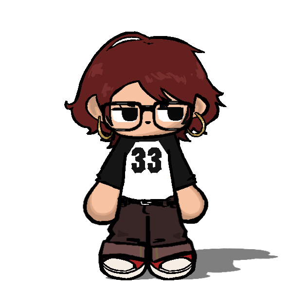

<h1>Oi!! Eu sou a Vikki ✨</h1>

 

  
   

 

<h1>⚙️Com o que eu já trabalhei?</h1>

 

 
    

    
      
      
      
      
      
      
      
      
      
      
  

  

  

     
    
    
    
    
    

<!--
**vikkivins/vikkivins** is a ✨ _special_ ✨ repository because its `README.md` (this file) appears on your GitHub profile.

Here are some ideas to get you started:

- 🔭 I’m currently working on ...
- 🌱 I’m currently learning ...
- 👯 I’m looking to collaborate on ...
- 🤔 I’m looking for help with ...
- 💬 Ask me about ...
- 📫 How to reach me: ...
- 😄 Pronouns: ...
- ⚡ Fun fact: ...
-->
